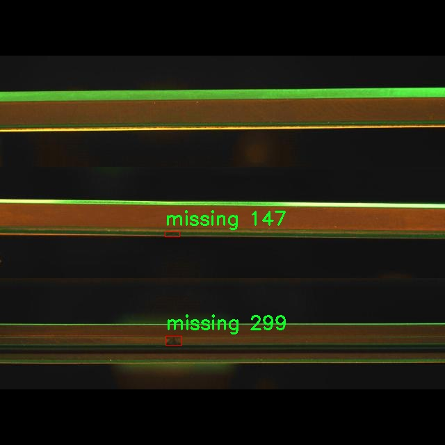

# 表面缺陷检测检测系统源码分享
 # [一条龙教学YOLOV8标注好的数据集一键训练_70+全套改进创新点发刊_Web前端展示]

### 1.研究背景与意义

项目参考[AAAI Association for the Advancement of Artificial Intelligence](https://gitee.com/qunshansj/projects)

项目来源[AACV Association for the Advancement of Computer Vision](https://gitee.com/qunmasj/projects)

研究背景与意义

随着工业自动化和智能制造的迅速发展，表面缺陷检测在生产质量控制中扮演着越来越重要的角色。传统的人工检测方法不仅效率低下，而且容易受到人为因素的影响，导致漏检和误检现象的发生。因此，基于计算机视觉的自动化检测系统逐渐成为解决这一问题的有效手段。近年来，深度学习技术的飞速发展为物体检测领域带来了革命性的变化，尤其是YOLO（You Only Look Once）系列模型在实时检测任务中展现出了卓越的性能。YOLOv8作为该系列的最新版本，结合了更为先进的网络结构和优化算法，具备了更高的检测精度和速度，适用于复杂的工业环境。

本研究旨在基于改进的YOLOv8模型，构建一个高效的表面缺陷检测系统，以实现对工业产品表面缺陷的自动化识别与分类。所使用的数据集“Bothside_all”包含2438张图像，涵盖了四类缺陷：切割缺陷（cut）、多余材料（excess-material）、缺失（missing）和粗糙表面（rough-surface）。这些缺陷的存在不仅影响产品的外观质量，还可能对其功能和使用寿命产生严重影响。因此，及时、准确地检测出这些缺陷，对于提高产品质量、降低生产成本具有重要的现实意义。

在现有的表面缺陷检测研究中，虽然已有多种方法被提出，但大多数方法在处理复杂背景和多样化缺陷时仍存在一定的局限性。YOLOv8模型通过引入新的特征提取模块和优化的损失函数，能够更好地适应多类缺陷的检测需求。此外，针对数据集中的不平衡问题，研究将采用数据增强技术，以提高模型的泛化能力和鲁棒性。通过对YOLOv8模型的改进与优化，期望能够显著提升检测精度和实时性，从而为工业生产提供更为可靠的技术支持。

本研究的意义不仅在于提升表面缺陷检测的技术水平，更在于推动智能制造的进程。通过实现高效的自动化检测，企业能够更好地控制生产过程中的质量风险，减少人工成本，提升生产效率。同时，研究成果还将为相关领域的学术研究提供参考，推动深度学习在工业应用中的进一步发展。综上所述，基于改进YOLOv8的表面缺陷检测系统的研究，不仅具有重要的理论价值，更具备广泛的应用前景，将为未来的智能制造和质量控制提供坚实的技术基础。

### 2.图片演示


##### 注意：由于此博客编辑较早，上面“2.图片演示”和“3.视频演示”展示的系统图片或者视频可能为老版本，新版本在老版本的基础上升级如下：（实际效果以升级的新版本为准）

  （1）适配了YOLOV8的“目标检测”模型和“实例分割”模型，通过加载相应的权重（.pt）文件即可自适应加载模型。

  （2）支持“图片识别”、“视频识别”、“摄像头实时识别”三种识别模式。

  （3）支持“图片识别”、“视频识别”、“摄像头实时识别”三种识别结果保存导出，解决手动导出（容易卡顿出现爆内存）存在的问题，识别完自动保存结果并导出到tempDir中。

  （4）支持Web前端系统中的标题、背景图等自定义修改，后面提供修改教程。

  另外本项目提供训练的数据集和训练教程,暂不提供权重文件（best.pt）,需要您按照教程进行训练后实现图片演示和Web前端界面演示的效果。

### 3.视频演示

[3.1 视频演示](https://www.bilibili.com/video/BV1xW4EeWEpo/)

### 4.数据集信息展示

##### 4.1 本项目数据集详细数据（类别数＆类别名）

nc: 4
names: ['cut', 'excess-material', 'missing', 'rough-surface']


##### 4.2 本项目数据集信息介绍

数据集信息展示

在本研究中，我们采用了名为“Bothside_all”的数据集，以支持改进YOLOv8的表面缺陷检测系统的训练和评估。该数据集专门针对表面缺陷的检测任务而设计，包含了丰富的样本和多样化的缺陷类型，旨在提高模型在实际应用中的准确性和鲁棒性。

“Bothside_all”数据集包含四个主要的缺陷类别，分别是“cut”（切割缺陷）、“excess-material”（多余材料）、“missing”（缺失）和“rough-surface”（粗糙表面）。这些类别的选择基于工业生产过程中常见的表面缺陷类型，涵盖了从原材料加工到成品检验的各个环节。每个类别都具有独特的特征和表现形式，这使得数据集在多样性和复杂性上具有很高的价值。

首先，切割缺陷（cut）是指在加工过程中，由于工具磨损或操作不当，导致材料表面出现不规则的切割痕迹。这种缺陷不仅影响产品的外观，还可能影响其功能和耐用性。其次，多余材料（excess-material）指的是在制造过程中，材料的过量堆积或粘附，通常会导致产品的不合格。缺失（missing）则是指在产品的某些部分缺少必要的材料或结构，这种缺陷可能导致产品无法正常使用，甚至引发安全隐患。最后，粗糙表面（rough-surface）是指产品表面处理不当，导致表面不平滑，影响美观和使用性能。

数据集的构建过程中，样本的采集和标注是至关重要的环节。为确保数据的质量和多样性，研究团队从多个生产线和工艺中收集了大量的图像数据。这些图像不仅包括不同类型的缺陷样本，还涵盖了各种光照条件、视角和背景，以模拟实际应用中可能遇到的各种情况。每个样本都经过专业人员的精确标注，确保每个缺陷类别的准确性和一致性。

在训练YOLOv8模型时，数据集的多样性和标注的准确性将直接影响模型的学习效果和最终性能。通过使用“Bothside_all”数据集，模型能够学习到不同缺陷的特征，从而提高其在实际应用中的检测能力。此外，数据集的丰富性也为模型的泛化能力提供了保障，使其能够适应不同的生产环境和条件。

综上所述，“Bothside_all”数据集为改进YOLOv8的表面缺陷检测系统提供了坚实的基础。通过对该数据集的深入分析和应用，我们期望能够显著提升表面缺陷检测的准确性和效率，为工业生产的质量控制提供有力支持。随着技术的不断进步和数据集的不断扩展，未来的研究将进一步探索更多缺陷类型的检测，推动表面缺陷检测技术的发展。





### 5.全套项目环境部署视频教程（零基础手把手教学）

[5.1 环境部署教程链接（零基础手把手教学）](https://www.ixigua.com/7404473917358506534?logTag=c807d0cbc21c0ef59de5)


[5.2 安装Python虚拟环境创建和依赖库安装视频教程链接（零基础手把手教学）](https://www.ixigua.com/7404474678003106304?logTag=1f1041108cd1f708b01a)

### 6.手把手YOLOV8训练视频教程（零基础小白有手就能学会）

[6.1 手把手YOLOV8训练视频教程（零基础小白有手就能学会）](https://www.ixigua.com/7404477157818401292?logTag=d31a2dfd1983c9668658)

### 7.70+种全套YOLOV8创新点代码加载调参视频教程（一键加载写好的改进模型的配置文件）

[7.1 70+种全套YOLOV8创新点代码加载调参视频教程（一键加载写好的改进模型的配置文件）](https://www.ixigua.com/7404478314661806627?logTag=29066f8288e3f4eea3a4)

### 8.70+种全套YOLOV8创新点原理讲解（非科班也可以轻松写刊发刊，V10版本正在科研待更新）

由于篇幅限制，每个创新点的具体原理讲解就不一一展开，具体见下列网址中的创新点对应子项目的技术原理博客网址【Blog】：


[8.1 70+种全套YOLOV8创新点原理讲解链接](https://gitee.com/qunmasj/good)

### 9.系统功能展示（检测对象为举例，实际内容以本项目数据集为准）

图9.1.系统支持检测结果表格显示

  图9.2.系统支持置信度和IOU阈值手动调节

  图9.3.系统支持自定义加载权重文件best.pt(需要你通过步骤5中训练获得)

  图9.4.系统支持摄像头实时识别

  图9.5.系统支持图片识别

  图9.6.系统支持视频识别

  图9.7.系统支持识别结果文件自动保存

  图9.8.系统支持Excel导出检测结果数据


### 10.原始YOLOV8算法原理

原始YOLOv8算法原理

YOLO（You Only Look Once）系列算法自其首次提出以来，便以其独特的目标检测方法而受到广泛关注。YOLOv8作为该系列的最新版本，继承并发展了前几代模型的优点，同时引入了一系列创新性的设计，旨在提高目标检测的精度和速度。YOLOv8的核心思想依然是将目标检测问题转化为回归问题，通过一个单一的神经网络模型同时预测目标的位置和类别。其网络结构主要由主干网络（backbone）、特征增强网络（neck）和检测头（head）三部分组成。

在主干网络方面，YOLOv8延续了YOLOv5中CSPDarknet的设计理念，采用了C2f模块替代了之前的C3模块。C2f模块的设计灵感来源于YOLOv7的ELAN思想，通过引入多个shortcut连接，增强了梯度流动，解决了深层网络中的梯度消失问题。这种结构不仅保持了输入和输出特征图的尺寸一致性，还通过分支结构有效地提取了更多的特征信息，提升了模型的表达能力。

特征增强网络采用了PAN-FPN（Path Aggregation Network - Feature Pyramid Network）结构，旨在实现多尺度特征的深度融合。YOLOv8通过自下而上的特征融合，将高层特征与中层和浅层特征进行结合，确保了模型在不同尺度目标检测时的准确性。该结构在上采样阶段去除了不必要的卷积操作，直接将高层特征与中层特征进行拼接，从而保留了更多的细节信息和语义信息，使得目标检测更加精准。

在检测头部分，YOLOv8引入了解耦头的设计，将目标分类和边框回归任务分开处理。这种解耦的方式使得每个任务能够更加专注于自身的目标，避免了以往耦合头在复杂场景下可能出现的定位不准和分类错误的问题。YOLOv8的检测头输出多个尺度的特征图，分别用于目标的分类和边框回归。通过这种方式，YOLOv8能够在保持高效性的同时，进一步提升检测精度。

YOLOv8的一个显著特点是采用了Anchor-free的目标检测方法。传统的目标检测算法通常依赖于预定义的锚点框，这在处理不同尺度和形状的目标时常常会带来不便。而YOLOv8通过回归的方式直接预测目标的位置和大小，省去了锚点框的定义和调整过程。这种方法使得网络能够更快地聚焦于目标位置的邻近点，从而使得预测框更接近于实际的边界框区域，显著提高了检测的准确性和效率。

在损失函数的设计上，YOLOv8采用了VFLLoss作为分类损失，并结合DFLLoss和CIoULoss作为回归损失。这种组合的损失函数能够有效地解决样本不平衡的问题，尤其是在处理小目标时，能够更好地引导模型学习。通过这种方式，YOLOv8在训练过程中能够更快地收敛，提升检测精度。

为了进一步增强模型的鲁棒性，YOLOv8在数据预处理阶段采用了多种数据增强技术，包括马赛克增强、混合增强、空间扰动和颜色扰动等。这些增强手段能够有效扩充训练样本的多样性，提高模型在实际应用中的适应能力。

总的来说，YOLOv8在设计上充分吸收了前几代YOLO模型的优点，同时结合了现代深度学习的最新技术，形成了一种高效、精准的目标检测方案。其在实时检测领域的应用潜力巨大，尤其是在嵌入式设备上的轻量化部署，使得YOLOv8能够在各种复杂环境中发挥出色的性能。随着YOLOv8的推出，目标检测技术的研究和应用将迎来新的发展机遇，为各行各业提供更为智能化的解决方案。


### 11.项目核心源码讲解（再也不用担心看不懂代码逻辑）

#### 11.1 code\ultralytics\models\sam\amg.py

以下是对代码中最核心部分的提取和详细注释：

```python
import torch
import numpy as np
from itertools import product
import math

def is_box_near_crop_edge(
    boxes: torch.Tensor, crop_box: List[int], orig_box: List[int], atol: float = 20.0
) -> torch.Tensor:
    """
    判断给定的边界框是否接近裁剪边缘。

    参数:
    boxes: 需要判断的边界框，形状为 (N, 4)，N为边界框数量。
    crop_box: 当前裁剪框的坐标 [x0, y0, x1, y1]。
    orig_box: 原始图像的边界框坐标 [x0, y0, x1, y1]。
    atol: 允许的绝对误差，默认为20.0。

    返回:
    返回一个布尔张量，指示每个边界框是否接近裁剪边缘。
    """
    crop_box_torch = torch.as_tensor(crop_box, dtype=torch.float, device=boxes.device)
    orig_box_torch = torch.as_tensor(orig_box, dtype=torch.float, device=boxes.device)
    boxes = uncrop_boxes_xyxy(boxes, crop_box).float()  # 将裁剪框内的边界框转换为原始坐标系
    near_crop_edge = torch.isclose(boxes, crop_box_torch[None, :], atol=atol, rtol=0)  # 判断是否接近裁剪框
    near_image_edge = torch.isclose(boxes, orig_box_torch[None, :], atol=atol, rtol=0)  # 判断是否接近原始图像边缘
    near_crop_edge = torch.logical_and(near_crop_edge, ~near_image_edge)  # 确保不接近原始图像边缘
    return torch.any(near_crop_edge, dim=1)  # 返回是否有任何边界框接近裁剪边缘

def generate_crop_boxes(
    im_size: Tuple[int, ...], n_layers: int, overlap_ratio: float
) -> Tuple[List[List[int]], List[int]]:
    """
    生成不同大小的裁剪框列表。

    参数:
    im_size: 图像的尺寸 (高度, 宽度)。
    n_layers: 裁剪层数。
    overlap_ratio: 重叠比例。

    返回:
    裁剪框列表和对应的层索引。
    """
    crop_boxes, layer_idxs = [], []
    im_h, im_w = im_size
    short_side = min(im_h, im_w)

    # 添加原始图像的裁剪框
    crop_boxes.append([0, 0, im_w, im_h])
    layer_idxs.append(0)

    def crop_len(orig_len, n_crops, overlap):
        """计算裁剪框的长度。"""
        return int(math.ceil((overlap * (n_crops - 1) + orig_len) / n_crops))

    for i_layer in range(n_layers):
        n_crops_per_side = 2 ** (i_layer + 1)  # 每层的裁剪框数量
        overlap = int(overlap_ratio * short_side * (2 / n_crops_per_side))  # 计算重叠长度

        crop_w = crop_len(im_w, n_crops_per_side, overlap)  # 计算裁剪框宽度
        crop_h = crop_len(im_h, n_crops_per_side, overlap)  # 计算裁剪框高度

        crop_box_x0 = [int((crop_w - overlap) * i) for i in range(n_crops_per_side)]
        crop_box_y0 = [int((crop_h - overlap) * i) for i in range(n_crops_per_side)]

        # 生成裁剪框
        for x0, y0 in product(crop_box_x0, crop_box_y0):
            box = [x0, y0, min(x0 + crop_w, im_w), min(y0 + crop_h, im_h)]
            crop_boxes.append(box)
            layer_idxs.append(i_layer + 1)

    return crop_boxes, layer_idxs

def uncrop_boxes_xyxy(boxes: torch.Tensor, crop_box: List[int]) -> torch.Tensor:
    """
    将裁剪框内的边界框转换为原始坐标系。

    参数:
    boxes: 裁剪框内的边界框，形状为 (N, 4)。
    crop_box: 当前裁剪框的坐标 [x0, y0, x1, y1]。

    返回:
    转换后的边界框。
    """
    x0, y0, _, _ = crop_box
    offset = torch.tensor([[x0, y0, x0, y0]], device=boxes.device)  # 计算偏移量
    if len(boxes.shape) == 3:  # 如果有通道维度
        offset = offset.unsqueeze(1)
    return boxes + offset  # 返回添加偏移后的边界框

def batched_mask_to_box(masks: torch.Tensor) -> torch.Tensor:
    """
    计算掩膜周围的边界框，返回格式为XYXY。

    参数:
    masks: 掩膜，形状为 CxHxW。

    返回:
    计算得到的边界框，形状为 Cx4。
    """
    if torch.numel(masks) == 0:  # 如果掩膜为空
        return torch.zeros(*masks.shape[:-2], 4, device=masks.device)

    shape = masks.shape
    h, w = shape[-2:]
    masks = masks.flatten(0, -3) if len(shape) > 2 else masks.unsqueeze(0)  # 规范化形状

    # 获取上下边缘
    in_height, _ = torch.max(masks, dim=-1)
    in_height_coords = in_height * torch.arange(h, device=in_height.device)[None, :]
    bottom_edges, _ = torch.max(in_height_coords, dim=-1)
    in_height_coords = in_height_coords + h * (~in_height)
    top_edges, _ = torch.min(in_height_coords, dim=-1)

    # 获取左右边缘
    in_width, _ = torch.max(masks, dim=-2)
    in_width_coords = in_width * torch.arange(w, device=in_width.device)[None, :]
    right_edges, _ = torch.max(in_width_coords, dim=-1)
    in_width_coords = in_width_coords + w * (~in_width)
    left_edges, _ = torch.min(in_width_coords, dim=-1)

    # 处理空掩膜的情况
    empty_filter = (right_edges < left_edges) | (bottom_edges < top_edges)
    out = torch.stack([left_edges, top_edges, right_edges, bottom_edges], dim=-1)
    out = out * (~empty_filter).unsqueeze(-1)

    return out.reshape(*shape[:-2], 4) if len(shape) > 2 else out[0  # 返回原始形状
```

### 代码核心部分说明
1. **`is_box_near_crop_edge`**: 判断边界框是否接近裁剪框的边缘，返回布尔值。
2. **`generate_crop_boxes`**: 生成不同大小的裁剪框，考虑重叠比例。
3. **`uncrop_boxes_xyxy`**: 将裁剪框内的边界框转换为原始图像坐标系。
4. **`batched_mask_to_box`**: 计算掩膜的边界框，返回XYXY格式的边界框。

这些函数在图像处理和目标检测任务中非常重要，尤其是在处理裁剪和边界框的生成时。

这个文件 `amg.py` 是 Ultralytics YOLO 项目的一部分，主要涉及图像处理和掩码操作，特别是在图像裁剪和区域稳定性评估方面。代码中使用了 PyTorch 和 NumPy 库，提供了一系列函数来处理图像的裁剪、掩码的稳定性评分、以及生成均匀分布的点网格等功能。

首先，`is_box_near_crop_edge` 函数用于判断给定的边界框是否接近裁剪边缘。它通过将边界框从裁剪区域转换回原始图像坐标系，并检查这些框是否接近裁剪边缘和图像边缘来实现这一点。函数返回一个布尔张量，指示哪些框接近裁剪边缘。

接下来，`batch_iterator` 函数用于生成数据的批次迭代器，确保输入的所有参数具有相同的长度。它计算出批次数量，并按批次返回数据。

`calculate_stability_score` 函数计算掩码的稳定性评分，使用交并比（IoU）来评估经过阈值处理的掩码的重叠程度。这个评分是通过比较高低阈值下的掩码来实现的。

`build_point_grid` 和 `build_all_layer_point_grids` 函数用于生成均匀分布的二维点网格，后者可以为多个裁剪层生成点网格，便于后续处理。

`generate_crop_boxes` 函数生成不同大小的裁剪框，基于输入图像的尺寸、层数和重叠比例。它计算每一层的裁剪框，并返回所有裁剪框及其对应的层索引。

`uncrop_boxes_xyxy`、`uncrop_points` 和 `uncrop_masks` 函数用于将裁剪后的边界框、点和掩码转换回原始图像坐标系。这些函数通过添加裁剪框的偏移量来实现。

`remove_small_regions` 函数用于移除掩码中的小区域或孔洞，使用 OpenCV 的连通组件分析来实现。它根据给定的面积阈值判断并修改掩码。

`batched_mask_to_box` 函数计算掩码周围的边界框，返回的边界框格式为 XYXY。如果掩码为空，则返回 `[0, 0, 0, 0]`。该函数处理多维掩码并返回相应的边界框。

整体来看，这个文件提供了一系列用于图像处理和分析的工具，尤其是在处理掩码和裁剪区域方面，为后续的计算机视觉任务提供了基础功能。

#### 11.2 70+种YOLOv8算法改进源码大全和调试加载训练教程（非必要）\ultralytics\utils\loss.py

以下是经过简化和注释的核心代码部分，主要包含了不同损失函数的实现。注释详细解释了每个类和方法的功能。

```python
import torch
import torch.nn as nn
import torch.nn.functional as F

class SlideLoss(nn.Module):
    def __init__(self, loss_fcn):
        """
        初始化 SlideLoss 类，接收一个损失函数作为参数。
        """
        super(SlideLoss, self).__init__()
        self.loss_fcn = loss_fcn
        self.reduction = loss_fcn.reduction
        self.loss_fcn.reduction = 'none'  # 将损失函数的归约方式设置为 'none'，以便对每个元素应用滑动损失

    def forward(self, pred, true, auto_iou=0.5):
        """
        计算滑动损失。
        :param pred: 预测值
        :param true: 真实值
        :param auto_iou: 自动计算的 IoU 值
        :return: 计算后的损失
        """
        loss = self.loss_fcn(pred, true)  # 计算基础损失
        if auto_iou < 0.2:
            auto_iou = 0.2  # 设置 IoU 的下限
        # 计算调制权重
        b1 = true <= auto_iou - 0.1
        a1 = 1.0
        b2 = (true > (auto_iou - 0.1)) & (true < auto_iou)
        a2 = math.exp(1.0 - auto_iou)
        b3 = true >= auto_iou
        a3 = torch.exp(-(true - 1.0))
        modulating_weight = a1 * b1 + a2 * b2 + a3 * b3  # 组合调制权重
        loss *= modulating_weight  # 应用调制权重
        return loss.mean() if self.reduction == 'mean' else loss.sum() if self.reduction == 'sum' else loss

class BboxLoss(nn.Module):
    def __init__(self, reg_max, use_dfl=False):
        """
        初始化 BboxLoss 类，设置最大正则化值和是否使用 DFL。
        :param reg_max: 最大正则化值
        :param use_dfl: 是否使用分布焦点损失
        """
        super().__init__()
        self.reg_max = reg_max
        self.use_dfl = use_dfl

    def forward(self, pred_dist, pred_bboxes, anchor_points, target_bboxes, target_scores, target_scores_sum, fg_mask):
        """
        计算边界框损失。
        :param pred_dist: 预测的分布
        :param pred_bboxes: 预测的边界框
        :param anchor_points: 锚点
        :param target_bboxes: 目标边界框
        :param target_scores: 目标分数
        :param target_scores_sum: 目标分数总和
        :param fg_mask: 前景掩码
        :return: 计算后的 IoU 损失和 DFL 损失
        """
        weight = target_scores.sum(-1)[fg_mask].unsqueeze(-1)  # 计算权重
        iou = bbox_iou(pred_bboxes[fg_mask], target_bboxes[fg_mask], xywh=False, CIoU=True)  # 计算 IoU
        loss_iou = ((1.0 - iou) * weight).sum() / target_scores_sum  # 计算 IoU 损失

        # DFL 损失
        if self.use_dfl:
            target_ltrb = bbox2dist(anchor_points, target_bboxes, self.reg_max)  # 将目标边界框转换为分布
            loss_dfl = self._df_loss(pred_dist[fg_mask].view(-1, self.reg_max + 1), target_ltrb[fg_mask]) * weight
            loss_dfl = loss_dfl.sum() / target_scores_sum
        else:
            loss_dfl = torch.tensor(0.0).to(pred_dist.device)

        return loss_iou, loss_dfl  # 返回 IoU 损失和 DFL 损失

    @staticmethod
    def _df_loss(pred_dist, target):
        """
        计算分布焦点损失。
        :param pred_dist: 预测的分布
        :param target: 目标值
        :return: DFL 损失
        """
        tl = target.long()  # 目标左边界
        tr = tl + 1  # 目标右边界
        wl = tr - target  # 左边权重
        wr = 1 - wl  # 右边权重
        return (F.cross_entropy(pred_dist, tl.view(-1), reduction='none').view(tl.shape) * wl +
                F.cross_entropy(pred_dist, tr.view(-1), reduction='none').view(tl.shape) * wr).mean(-1, keepdim=True)

class v8DetectionLoss:
    def __init__(self, model):
        """
        初始化 v8DetectionLoss 类，设置模型相关属性和损失函数。
        :param model: 训练的模型
        """
        device = next(model.parameters()).device  # 获取模型设备
        self.bce = nn.BCEWithLogitsLoss(reduction='none')  # 使用二元交叉熵损失
        self.bbox_loss = BboxLoss(model.reg_max - 1, use_dfl=model.reg_max > 1).to(device)  # 初始化边界框损失

    def __call__(self, preds, batch):
        """
        计算总损失并返回。
        :param preds: 预测值
        :param batch: 批次数据
        :return: 总损失和损失张量
        """
        loss = torch.zeros(3, device=self.device)  # 初始化损失
        # 计算边界框损失
        pred_bboxes = self.bbox_decode(preds)  # 解码预测边界框
        loss[0], loss[2] = self.bbox_loss(pred_bboxes, batch['bboxes'], batch['scores'])  # 计算损失
        return loss.sum() * batch_size, loss.detach()  # 返回总损失和损失张量
```

### 代码说明：
1. **SlideLoss**: 实现了一种滑动损失，通过调制权重来影响损失的计算。
2. **BboxLoss**: 计算边界框的损失，包括 IoU 损失和可选的分布焦点损失（DFL）。
3. **v8DetectionLoss**: 作为整体损失的计算类，整合了边界框损失和其他损失函数，提供了计算总损失的接口。

以上代码展示了如何在深度学习模型中实现损失函数的计算，特别是在目标检测任务中。

这个程序文件是YOLOv8算法中用于计算损失的模块，包含了多种损失函数的实现，主要用于目标检测、分割和关键点检测等任务。文件的核心是定义了多个损失类，每个类负责不同类型的损失计算。

首先，`SlideLoss`类和`EMASlideLoss`类实现了滑动损失（Slide Loss）和指数移动平均滑动损失（EMA Slide Loss）。这两种损失函数通过对IoU（Intersection over Union）值进行调节，来加权损失的计算，从而使得模型在训练过程中更加关注难以检测的样本。

接下来，`VarifocalLoss`和`FocalLoss`类实现了变焦损失和焦点损失。焦点损失通过增加难易样本的权重来解决类别不平衡的问题，而变焦损失则在此基础上进一步改进，适用于二分类任务。

`BboxLoss`类则专注于边界框的损失计算，结合了IoU损失和DFL（Distribution Focal Loss），用于提高边界框预测的准确性。该类通过计算预测边界框与真实边界框之间的差异，来优化模型的输出。

`KeypointLoss`类用于计算关键点的损失，主要是通过欧几里得距离来评估预测关键点与真实关键点之间的差异，同时考虑了关键点的可见性。

`v8DetectionLoss`类是一个综合性的损失计算类，负责整合目标检测任务中的各种损失，包括边界框损失、分类损失和DFL损失。它还实现了目标分配器，用于将预测结果与真实标签进行匹配，并计算最终的损失值。

`v8SegmentationLoss`和`v8PoseLoss`类则分别扩展了目标检测损失，添加了分割和姿态估计的特定损失计算。这些类在目标检测的基础上，增加了对分割掩码和关键点的处理，适应更复杂的任务需求。

最后，`v8ClassificationLoss`类用于计算分类任务的损失，使用交叉熵损失函数来评估预测类别与真实类别之间的差异。

整体来看，这个文件实现了YOLOv8模型在训练过程中所需的多种损失函数，旨在提高模型的检测、分割和关键点预测的性能。通过这些损失函数的组合，模型能够在不同任务中实现更好的学习效果。

#### 11.3 ui.py

以下是代码中最核心的部分，并附上详细的中文注释：

```python
import sys
import subprocess

def run_script(script_path):
    """
    使用当前 Python 环境运行指定的脚本。

    Args:
        script_path (str): 要运行的脚本路径

    Returns:
        None
    """
    # 获取当前 Python 解释器的路径
    python_path = sys.executable

    # 构建运行命令，使用 streamlit 运行指定的脚本
    command = f'"{python_path}" -m streamlit run "{script_path}"'

    # 执行命令，并等待其完成
    result = subprocess.run(command, shell=True)
    
    # 检查命令执行的返回码，如果不为0则表示出错
    if result.returncode != 0:
        print("脚本运行出错。")

# 实例化并运行应用
if __name__ == "__main__":
    # 指定要运行的脚本路径
    script_path = "web.py"  # 假设脚本在当前目录下

    # 调用函数运行脚本
    run_script(script_path)
```

### 代码注释说明：
1. **导入模块**：
   - `sys`：用于访问与 Python 解释器紧密相关的变量和函数。
   - `subprocess`：用于执行外部命令和与其交互。

2. **定义 `run_script` 函数**：
   - 该函数接受一个参数 `script_path`，表示要运行的 Python 脚本的路径。
   - 使用 `sys.executable` 获取当前 Python 解释器的路径，以确保使用正确的 Python 环境。

3. **构建命令**：
   - 使用 `f-string` 格式化字符串构建命令，调用 `streamlit` 模块来运行指定的脚本。

4. **执行命令**：
   - 使用 `subprocess.run` 执行构建的命令，并设置 `shell=True` 以在 shell 中运行命令。
   - 该函数会等待命令执行完成，并返回一个结果对象。

5. **检查返回码**：
   - 通过检查 `result.returncode` 来判断命令是否成功执行。如果返回码不为0，表示脚本运行出错，并打印错误信息。

6. **主程序入口**：
   - 在 `if __name__ == "__main__":` 块中，指定要运行的脚本路径，并调用 `run_script` 函数执行该脚本。

这个程序文件的主要功能是使用当前的 Python 环境来运行一个指定的脚本，具体来说是一个名为 `web.py` 的脚本。程序首先导入了必要的模块，包括 `sys`、`os` 和 `subprocess`，这些模块分别用于访问 Python 解释器的信息、操作系统功能以及执行外部命令。

在 `run_script` 函数中，首先获取当前 Python 解释器的路径，这通过 `sys.executable` 实现。接着，构建一个命令字符串，该命令用于运行 `streamlit`，这是一个用于构建数据应用的库。命令的格式是将 Python 解释器的路径和要运行的脚本路径结合起来，形成一个完整的命令。

然后，使用 `subprocess.run` 方法来执行这个命令。这个方法会在一个新的 shell 中运行命令，并等待其完成。如果命令执行的返回码不为零，表示脚本运行出错，程序会打印出相应的错误信息。

在文件的最后部分，使用 `if __name__ == "__main__":` 这一行确保只有在直接运行该文件时，下面的代码才会被执行。这里指定了要运行的脚本路径为 `web.py`，并调用 `run_script` 函数来执行它。

总的来说，这个程序的作用是提供一个简单的接口来运行一个特定的 Python 脚本，并处理可能出现的错误。

#### 11.4 70+种YOLOv8算法改进源码大全和调试加载训练教程（非必要）\ultralytics\models\rtdetr\__init__.py

以下是代码中最核心的部分，并附上详细的中文注释：

```python
# 导入RTDETR模型、预测器和验证器
from .model import RTDETR  # 导入RTDETR模型类
from .predict import RTDETRPredictor  # 导入RTDETR预测器类
from .val import RTDETRValidator  # 导入RTDETR验证器类

# 定义模块的公开接口，允许外部访问这些类
__all__ = 'RTDETRPredictor', 'RTDETRValidator', 'RTDETR'  # 公开RTDETR预测器、验证器和模型
```

### 代码解释：
1. **导入模块**：
   - `from .model import RTDETR`：从当前包的`model`模块中导入`RTDETR`类，通常这个类是实现目标检测模型的核心部分。
   - `from .predict import RTDETRPredictor`：从当前包的`predict`模块中导入`RTDETRPredictor`类，这个类负责使用模型进行预测。
   - `from .val import RTDETRValidator`：从当前包的`val`模块中导入`RTDETRValidator`类，这个类用于验证模型的性能。

2. **定义公开接口**：
   - `__all__`是一个特殊变量，用于定义当使用`from module import *`时，哪些名称会被导入。这里定义了三个名称：`RTDETRPredictor`、`RTDETRValidator`和`RTDETR`，这意味着这些类可以被外部模块直接访问。

这个程序文件是Ultralytics YOLO项目的一部分，主要用于定义和导入与RTDETR（一个YOLO的变种）相关的模块和类。文件的开头包含了一条版权声明，表明该代码遵循AGPL-3.0许可证。

在文件中，首先从同一目录下的`model`模块导入了`RTDETR`类，这个类可能是实现RTDETR模型的核心部分。接着，从`predict`模块导入了`RTDETRPredictor`类，这个类的功能可能是用于进行预测，即使用训练好的模型对新数据进行推断。最后，从`val`模块导入了`RTDETRValidator`类，这个类通常用于模型验证，帮助评估模型在验证集上的表现。

在文件的最后，使用`__all__`变量定义了模块的公共接口，列出了可以被外部导入的类名。这意味着当其他模块使用`from . import *`语句时，只会导入`RTDETRPredictor`、`RTDETRValidator`和`RTDETR`这三个类，确保了模块的封装性和可维护性。通过这种方式，用户可以方便地使用这些类，而不需要了解模块内部的实现细节。

#### 11.5 train.py

以下是经过简化和注释的核心代码部分，主要集中在 YOLO 模型的训练过程和数据处理上：

```python
import random
import numpy as np
import torch.nn as nn
from ultralytics.data import build_dataloader, build_yolo_dataset
from ultralytics.engine.trainer import BaseTrainer
from ultralytics.models import yolo
from ultralytics.nn.tasks import DetectionModel
from ultralytics.utils import LOGGER, RANK
from ultralytics.utils.torch_utils import de_parallel, torch_distributed_zero_first

class DetectionTrainer(BaseTrainer):
    """
    基于检测模型的训练类，继承自 BaseTrainer。
    """

    def build_dataset(self, img_path, mode="train", batch=None):
        """
        构建 YOLO 数据集。

        参数:
            img_path (str): 包含图像的文件夹路径。
            mode (str): 模式，可以是 'train' 或 'val'，用户可以为每种模式自定义不同的增强。
            batch (int, optional): 批次大小，仅用于 'rect' 模式。默认为 None。
        """
        gs = max(int(de_parallel(self.model).stride.max() if self.model else 0), 32)  # 获取模型的最大步幅
        return build_yolo_dataset(self.args, img_path, batch, self.data, mode=mode, rect=mode == "val", stride=gs)

    def get_dataloader(self, dataset_path, batch_size=16, rank=0, mode="train"):
        """构建并返回数据加载器。"""
        assert mode in ["train", "val"]  # 确保模式有效
        with torch_distributed_zero_first(rank):  # 在分布式训练中，仅初始化一次数据集
            dataset = self.build_dataset(dataset_path, mode, batch_size)
        shuffle = mode == "train"  # 训练模式下打乱数据
        workers = self.args.workers if mode == "train" else self.args.workers * 2  # 根据模式设置工作线程数
        return build_dataloader(dataset, batch_size, workers, shuffle, rank)  # 返回数据加载器

    def preprocess_batch(self, batch):
        """对图像批次进行预处理，包括缩放和转换为浮点数。"""
        batch["img"] = batch["img"].to(self.device, non_blocking=True).float() / 255  # 将图像数据归一化到 [0, 1]
        if self.args.multi_scale:  # 如果启用多尺度训练
            imgs = batch["img"]
            sz = (
                random.randrange(self.args.imgsz * 0.5, self.args.imgsz * 1.5 + self.stride)
                // self.stride
                * self.stride
            )  # 随机选择图像大小
            sf = sz / max(imgs.shape[2:])  # 计算缩放因子
            if sf != 1:
                ns = [
                    math.ceil(x * sf / self.stride) * self.stride for x in imgs.shape[2:]
                ]  # 计算新的图像形状
                imgs = nn.functional.interpolate(imgs, size=ns, mode="bilinear", align_corners=False)  # 进行插值缩放
            batch["img"] = imgs  # 更新批次图像
        return batch

    def get_model(self, cfg=None, weights=None, verbose=True):
        """返回 YOLO 检测模型。"""
        model = DetectionModel(cfg, nc=self.data["nc"], verbose=verbose and RANK == -1)  # 创建检测模型
        if weights:
            model.load(weights)  # 加载权重
        return model

    def plot_training_samples(self, batch, ni):
        """绘制带有注释的训练样本。"""
        plot_images(
            images=batch["img"],
            batch_idx=batch["batch_idx"],
            cls=batch["cls"].squeeze(-1),
            bboxes=batch["bboxes"],
            paths=batch["im_file"],
            fname=self.save_dir / f"train_batch{ni}.jpg",
            on_plot=self.on_plot,
        )

    def plot_metrics(self):
        """从 CSV 文件中绘制指标。"""
        plot_results(file=self.csv, on_plot=self.on_plot)  # 保存结果图像
```

### 代码说明：
1. **构建数据集**：`build_dataset` 方法用于根据给定的图像路径和模式（训练或验证）构建 YOLO 数据集。
2. **获取数据加载器**：`get_dataloader` 方法构建并返回一个数据加载器，支持分布式训练和多线程。
3. **预处理批次**：`preprocess_batch` 方法对输入的图像批次进行归一化和缩放处理，以适应模型的输入要求。
4. **获取模型**：`get_model` 方法返回一个 YOLO 检测模型，并可选择性地加载预训练权重。
5. **绘制训练样本和指标**：`plot_training_samples` 和 `plot_metrics` 方法用于可视化训练过程中的样本和性能指标。

这个程序文件 `train.py` 是一个用于训练目标检测模型的脚本，主要基于 YOLO（You Only Look Once）模型架构。文件中定义了一个名为 `DetectionTrainer` 的类，该类继承自 `BaseTrainer`，并提供了一系列方法来构建数据集、加载数据、预处理图像、设置模型属性、获取模型、验证模型、记录损失、绘制训练样本和指标等功能。

在 `DetectionTrainer` 类中，`build_dataset` 方法用于构建 YOLO 数据集，接收图像路径、模式（训练或验证）和批次大小作为参数。该方法通过调用 `build_yolo_dataset` 函数来创建数据集，并根据模型的步幅（stride）来确定数据集的处理方式。

`get_dataloader` 方法用于构建并返回数据加载器。它会根据模式（训练或验证）来设置数据集的随机打乱（shuffle）选项，并且在分布式训练的情况下，确保数据集只初始化一次。

`preprocess_batch` 方法负责对图像批次进行预处理，包括将图像缩放到适当的大小并转换为浮点数格式。它还支持多尺度训练，通过随机选择图像大小来增强模型的鲁棒性。

`set_model_attributes` 方法用于设置模型的属性，包括类别数量和类别名称等。这些属性是根据数据集的元数据进行配置的。

`get_model` 方法返回一个 YOLO 检测模型，并可以选择加载预训练权重。`get_validator` 方法则返回一个用于验证模型性能的验证器。

`label_loss_items` 方法用于返回带有标签的训练损失项字典，这对于目标检测任务是必要的，因为它需要跟踪不同类型的损失（如边界框损失、类别损失等）。

`progress_string` 方法返回一个格式化的字符串，显示训练进度，包括当前的轮次、GPU 内存使用情况、损失值、实例数量和图像大小等信息。

`plot_training_samples` 方法用于绘制训练样本及其注释，帮助可视化训练过程中的样本数据。`plot_metrics` 和 `plot_training_labels` 方法则用于绘制训练过程中的指标和标签，分别从 CSV 文件和数据集中提取信息进行可视化。

整体而言，这个文件提供了一个结构化的方式来训练 YOLO 模型，涵盖了从数据准备到模型训练和评估的各个方面。

#### 11.6 70+种YOLOv8算法改进源码大全和调试加载训练教程（非必要）\ultralytics\trackers\utils\matching.py

以下是经过简化和详细注释的核心代码部分：

```python
import numpy as np
import scipy
from scipy.spatial.distance import cdist
from ultralytics.utils.metrics import bbox_ioa

try:
    import lap  # 导入线性分配库
    assert lap.__version__  # 确保导入的库是有效的
except (ImportError, AssertionError, AttributeError):
    from ultralytics.utils.checks import check_requirements
    check_requirements('lapx>=0.5.2')  # 检查并安装所需的库
    import lap

def linear_assignment(cost_matrix, thresh, use_lap=True):
    """
    使用线性分配算法进行匹配。

    参数:
        cost_matrix (np.ndarray): 成本矩阵，包含分配的成本值。
        thresh (float): 有效分配的阈值。
        use_lap (bool, optional): 是否使用 lap.lapjv 方法。默认为 True。

    返回:
        (tuple): 包含匹配索引、未匹配的索引（来自 'a'）和未匹配的索引（来自 'b'）的元组。
    """
    if cost_matrix.size == 0:
        # 如果成本矩阵为空，返回空匹配和所有未匹配索引
        return np.empty((0, 2), dtype=int), tuple(range(cost_matrix.shape[0])), tuple(range(cost_matrix.shape[1]))

    if use_lap:
        # 使用 lap 库进行线性分配
        _, x, y = lap.lapjv(cost_matrix, extend_cost=True, cost_limit=thresh)
        matches = [[ix, mx] for ix, mx in enumerate(x) if mx >= 0]  # 找到匹配
        unmatched_a = np.where(x < 0)[0]  # 找到未匹配的 'a'
        unmatched_b = np.where(y < 0)[0]  # 找到未匹配的 'b'
    else:
        # 使用 scipy 的线性和分配方法
        x, y = scipy.optimize.linear_sum_assignment(cost_matrix)  # 行 x，列 y
        matches = np.asarray([[x[i], y[i]] for i in range(len(x)) if cost_matrix[x[i], y[i]] <= thresh])
        if len(matches) == 0:
            unmatched_a = list(np.arange(cost_matrix.shape[0]))
            unmatched_b = list(np.arange(cost_matrix.shape[1]))
        else:
            unmatched_a = list(set(np.arange(cost_matrix.shape[0])) - set(matches[:, 0]))
            unmatched_b = list(set(np.arange(cost_matrix.shape[1])) - set(matches[:, 1]))

    return matches, unmatched_a, unmatched_b  # 返回匹配和未匹配的索引

def iou_distance(atracks, btracks):
    """
    基于交并比（IoU）计算轨迹之间的成本。

    参数:
        atracks (list[STrack] | list[np.ndarray]): 轨迹 'a' 或边界框的列表。
        btracks (list[STrack] | list[np.ndarray]): 轨迹 'b' 或边界框的列表。

    返回:
        (np.ndarray): 基于 IoU 计算的成本矩阵。
    """
    # 将轨迹转换为边界框格式
    atlbrs = [track.tlbr for track in atracks] if not isinstance(atracks[0], np.ndarray) else atracks
    btlbrs = [track.tlbr for track in btracks] if not isinstance(btracks[0], np.ndarray) else btracks

    ious = np.zeros((len(atlbrs), len(btlbrs)), dtype=np.float32)  # 初始化 IoU 矩阵
    if len(atlbrs) and len(btlbrs):
        # 计算 IoU
        ious = bbox_ioa(np.ascontiguousarray(atlbrs, dtype=np.float32),
                        np.ascontiguousarray(btlbrs, dtype=np.float32),
                        iou=True)
    return 1 - ious  # 返回成本矩阵（1 - IoU）

def embedding_distance(tracks, detections, metric='cosine'):
    """
    基于嵌入计算轨迹和检测之间的距离。

    参数:
        tracks (list[STrack]): 轨迹列表。
        detections (list[BaseTrack]): 检测列表。
        metric (str, optional): 距离计算的度量方式。默认为 'cosine'。

    返回:
        (np.ndarray): 基于嵌入计算的成本矩阵。
    """
    cost_matrix = np.zeros((len(tracks), len(detections)), dtype=np.float32)  # 初始化成本矩阵
    if cost_matrix.size == 0:
        return cost_matrix
    det_features = np.asarray([track.curr_feat for track in detections], dtype=np.float32)  # 获取检测特征
    track_features = np.asarray([track.smooth_feat for track in tracks], dtype=np.float32)  # 获取轨迹特征
    cost_matrix = np.maximum(0.0, cdist(track_features, det_features, metric))  # 计算距离并确保非负
    return cost_matrix  # 返回成本矩阵

def fuse_score(cost_matrix, detections):
    """
    将成本矩阵与检测分数融合，生成单一相似度矩阵。

    参数:
        cost_matrix (np.ndarray): 包含分配成本值的矩阵。
        detections (list[BaseTrack]): 带有分数的检测列表。

    返回:
        (np.ndarray): 融合后的相似度矩阵。
    """
    if cost_matrix.size == 0:
        return cost_matrix
    iou_sim = 1 - cost_matrix  # 计算 IoU 相似度
    det_scores = np.array([det.score for det in detections])  # 获取检测分数
    det_scores = np.expand_dims(det_scores, axis=0).repeat(cost_matrix.shape[0], axis=0)  # 扩展分数以匹配成本矩阵
    fuse_sim = iou_sim * det_scores  # 融合相似度
    return 1 - fuse_sim  # 返回融合后的成本
```

### 代码说明：
1. **线性分配（linear_assignment）**：该函数根据给定的成本矩阵和阈值，使用线性分配算法（可以选择使用 `lap` 或 `scipy`）来找到最佳匹配。返回匹配的索引和未匹配的索引。

2. **IoU 距离（iou_distance）**：该函数计算两个轨迹集合之间的交并比（IoU），并返回一个成本矩阵。IoU 越高，成本越低。

3. **嵌入距离（embedding_distance）**：该函数计算轨迹和检测之间的距离，使用嵌入特征（如深度学习模型提取的特征）来计算相似度。

4. **融合分数（fuse_score）**：该函数将成本矩阵与检测分数结合，生成一个融合的相似度矩阵，便于后续的匹配决策。

这个程序文件是用于实现YOLOv8算法中的匹配功能，主要用于跟踪目标的算法部分。文件中包含了一些函数，这些函数的主要目的是通过计算代价矩阵来实现目标跟踪中的匹配过程。

首先，文件导入了必要的库，包括NumPy和SciPy。NumPy用于高效的数组操作，而SciPy则提供了优化算法的实现。特别是，文件尝试导入`lap`库，这是一个用于线性分配的库，如果未能成功导入，则会检查并安装相应的依赖。

接下来，`linear_assignment`函数是核心函数之一。它接收一个代价矩阵和一个阈值，使用`lap`库或`scipy`库来执行线性分配。函数返回匹配的索引以及未匹配的索引。代价矩阵的大小为零时，函数会返回空的匹配结果和所有未匹配的索引。

`iou_distance`函数计算两个跟踪对象之间的代价，基于它们的交并比（IoU）。该函数首先判断输入的跟踪对象是否为NumPy数组，如果是，则直接使用它们；否则，从跟踪对象中提取边界框。接着，函数使用`bbox_ioa`函数计算IoU，并返回1减去IoU的值作为代价矩阵。

`embedding_distance`函数计算跟踪对象和检测对象之间的距离，基于它们的特征嵌入。该函数创建一个代价矩阵，利用SciPy的`cdist`函数计算特征之间的距离。默认情况下，使用余弦距离度量。

最后，`fuse_score`函数将代价矩阵与检测分数融合，生成一个单一的相似度矩阵。它首先计算IoU相似度，然后将检测分数扩展到与代价矩阵相同的形状，最后将这两个矩阵相乘并返回融合后的代价矩阵。

整体来看，这个文件实现了目标跟踪中重要的匹配机制，通过计算不同对象之间的代价，帮助算法在视频流中持续跟踪目标。

### 12.系统整体结构（节选）

### 整体功能和构架概括

该项目是一个基于YOLO（You Only Look Once）算法的目标检测和跟踪系统，包含多个模块和功能。整体架构分为几个主要部分：

1. **模型定义与训练**：包括YOLOv8和RTDETR等模型的定义、训练和损失计算。模型的训练模块负责数据集的构建、数据加载、模型属性设置、损失计算和训练过程的可视化。

2. **损失函数**：实现了多种损失函数，用于优化目标检测、分割和关键点检测任务，确保模型在训练过程中能够有效学习。

3. **数据处理与预处理**：提供了数据集的构建和预处理功能，包括图像缩放、数据增强等，以提高模型的鲁棒性。

4. **目标跟踪**：实现了目标跟踪的匹配机制，通过计算代价矩阵来持续跟踪视频流中的目标。

5. **用户界面**：提供了一个简单的用户界面脚本，用于运行特定的训练或推理脚本。

6. **工具函数**：包括文件操作、数据集管理和其他实用工具，支持整个项目的功能。

### 文件功能整理表

| 文件路径                                                                                         | 功能描述                                                                                           |
|--------------------------------------------------------------------------------------------------|----------------------------------------------------------------------------------------------------|
| `code\ultralytics\models\sam\amg.py`                                                           | 实现图像处理和掩码操作，包括裁剪、掩码稳定性评分和边界框转换等功能。                              |
| `70+种YOLOv8算法改进源码大全和调试加载训练教程（非必要）\ultralytics\utils\loss.py`            | 定义多种损失函数，包括滑动损失、焦点损失、边界框损失等，用于优化目标检测和分割任务。               |
| `ui.py`                                                                                         | 提供一个简单的用户界面，用于运行指定的脚本（如`web.py`）。                                        |
| `70+种YOLOv8算法改进源码大全和调试加载训练教程（非必要）\ultralytics\models\rtdetr\__init__.py` | 导入RTDETR模型及其相关类，为RTDETR模型的使用提供接口。                                           |
| `train.py`                                                                                      | 负责训练YOLO模型，包括数据集构建、模型训练、损失记录和可视化等功能。                             |
| `70+种YOLOv8算法改进源码大全和调试加载训练教程（非必要）\ultralytics\trackers\utils\matching.py` | 实现目标跟踪中的匹配机制，通过计算代价矩阵来跟踪目标。                                           |
| `code\ultralytics\models\yolo\obb\val.py`                                                     | 实现YOLO模型的验证功能，评估模型在验证集上的表现。                                               |
| `70+种YOLOv8算法改进源码大全和调试加载训练教程（非必要）\ultralytics\models\yolo\pose\train.py` | 负责姿态估计模型的训练，类似于`train.py`，但专注于关键点检测任务。                               |
| `70+种YOLOv8算法改进源码大全和调试加载训练教程（非必要）\ultralytics\utils\files.py`         | 提供文件操作相关的工具函数，支持数据集管理和文件处理。                                           |
| `code\ultralytics\data\explorer\utils.py`                                                     | 包含数据探索和分析的工具函数，可能用于数据集的可视化和分析。                                     |
| `70+种YOLOv8算法改进源码大全和调试加载训练教程（非必要）\ultralytics\models\rtdetr\model.py`  | 定义RTDETR模型的结构和前向传播逻辑，负责模型的具体实现。                                         |
| `70+种YOLOv8算法改进源码大全和调试加载训练教程（非必要）\ultralytics\models\sam\__init__.py` | 导入SAM模型及其相关类，为SAM模型的使用提供接口。                                                |
| `code\ultralytics\trackers\utils\matching.py`                                                  | 实现目标跟踪中的匹配功能，计算目标之间的距离和相似度，支持多种距离度量方法。                     |

这个表格概述了每个文件的主要功能，展示了项目的结构和各个模块之间的关系。整体来看，该项目为目标检测和跟踪提供了一个完整的解决方案，涵盖了从模型训练到推理的各个方面。

注意：由于此博客编辑较早，上面“11.项目核心源码讲解（再也不用担心看不懂代码逻辑）”中部分代码可能会优化升级，仅供参考学习，完整“训练源码”、“Web前端界面”和“70+种创新点源码”以“13.完整训练+Web前端界面+70+种创新点源码、数据集获取”的内容为准。

### 13.完整训练+Web前端界面+70+种创新点源码、数据集获取


# [下载链接：https://mbd.pub/o/bread/ZpuUlJ5q](https://mbd.pub/o/bread/ZpuUlJ5q)